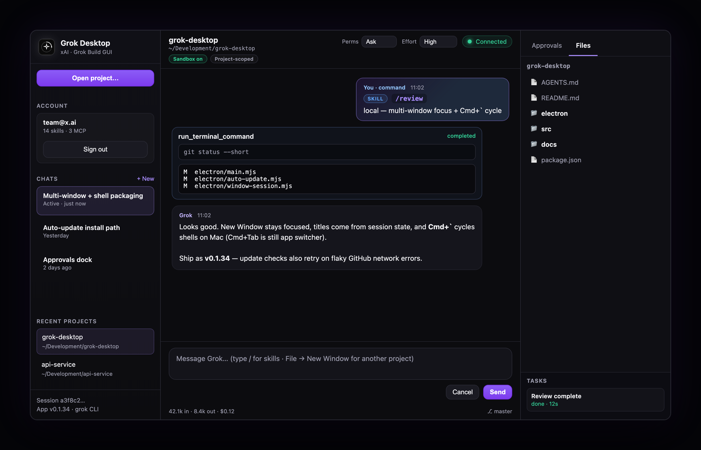
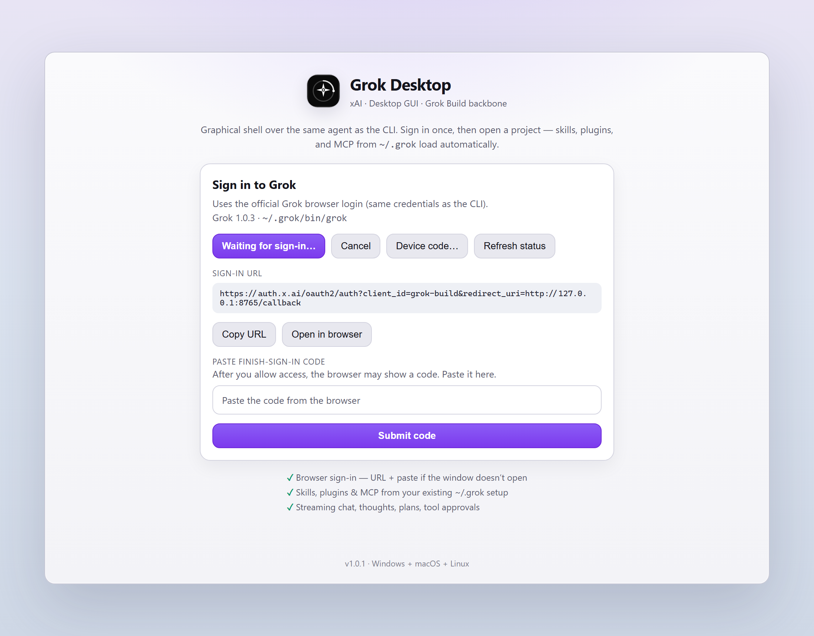
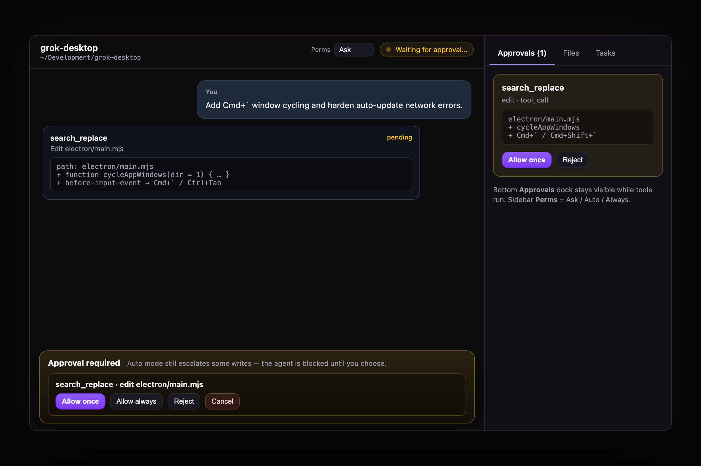

# Grok Desktop

Desktop GUI for the [Grok Build](https://github.com/xai-org/grok-build) coding agent — chat, tools, approvals, and project sessions over ACP.

<p align="center">
  
</p>

<p align="center">
  
  &nbsp;
  
</p>

<p align="center"><sub>Chat + slash skills · browser sign-in · tool approvals with readable input</sub></p>

## Install for the team (no npm)

**Nobody needs Node or npm.** Open the latest
[GitHub Release](https://github.com/liaan/grok-desktop/releases/latest)
and download **one** file:

| You have… | File | What to do |
|-----------|------|------------|
| **Windows** | `…-Windows-Setup.exe` | Double-click → install |
| **Mac (M1/M2/M3/M4)** | `…-Mac-AppleSilicon.dmg` | Open DMG → drag app to **Applications** → then see Mac note below |
| **Mac (Intel)** | `…-Mac-Intel.dmg` | Same as above |
| **Source code** | GitHub **Source code (zip)** | Only if you want to build from source |

**Team install:** use Setup.exe or a DMG only. Files named `latest.yml`, `latest-mac.yml`, Mac `.zip`, or blockmap are for **in-app auto-update** (not hand install). Skip AppImage/portable.

Also install the **Grok Build CLI** (`grok`) — this app is only the GUI.

Then: **Grok Desktop** → **Sign in with browser** → **Open project…**

**Updates:** in a packaged install, **Help → Check for updates…** checks GitHub Releases and downloads the next version in-app (restart when prompted). You only need a fresh installer from Releases if auto-update metadata is missing for that build.

### Mac: “damaged and can’t be opened”

macOS does this for **unsigned / team builds** downloaded from the internet (Safari quarantine). Use **v0.1.3+** if Apple Silicon DMGs from 0.1.2 refuse to open (broken partial signature — fixed in 0.1.3).

**Fix (once per install):**

1. Drag **Grok Desktop** into **Applications** (not only run from the DMG).
2. Eject the DMG.
3. Open **Terminal** and run:

```bash
xattr -cr "/Applications/Grok Desktop.app"
```

4. Open **Grok Desktop** from Applications (double-click or Spotlight).

If it still complains: right-click the app → **Open** → **Open**.

Until the company signs + notarizes with an Apple Developer ID, this step is normal for internal team builds.

> **Windows:** SmartScreen → **More info → Run anyway**.

---

This project is **not** a reimplementation of the agent, models, or tools. It is an **Electron + React** app that:

1. Signs you in with the same browser flow as the Grok CLI (`grok login`)
2. Opens a project folder
3. Spawns `grok agent stdio` and talks **Agent Client Protocol (ACP)** over JSON-RPC
4. Reuses your existing `~/.grok` setup — skills, MCP servers, plugins, models, and auth

```text
┌────────────────────────────┐
│  Grok Desktop (this repo)  │  chat · tools · approvals · projects
└─────────────┬──────────────┘
              │ ACP / stdio
┌─────────────▼──────────────┐
│  grok agent (installed CLI)│  models · skills · MCP · auth · tools
└────────────────────────────┘
```

Runs on **Windows, macOS, and Linux** (Electron). Team installers currently ship for **Windows + macOS** from Releases; Linux is source/`npm run dist` for now. You need the Grok Build CLI installed; day-to-day login can be done entirely in the app.

## Features

| Area | Status |
|------|--------|
| In-app browser sign-in / sign-out | Done |
| Optional API key for this session | Done |
| Skills & MCP **inherited** from `~/.grok` (same as CLI) | Done — invoke in chat; **edit in CLI** |
| Project rules (`AGENTS.md`, etc.) via open folder | Done — agent uses project as cwd (same as CLI) |
| Open project + recent folders | Done |
| Streaming messages, thoughts, plans, tool cards | Done |
| Tool permission approvals + always-approve | Done |
| Cancel + mid-turn queue / send-now | Done |
| Slash menu (skills + local `/new`) | Done |
| Simple file list peek | Basic |
| Diff review pane | Planned |
| Resume CLI sessions with history | Done (same `~/.grok/sessions`) |
| Multi-session tabs | Basic (sidebar chat list) |
| Settings UI (model / MCP / skills editor) | **Planned** — configure under `~/.grok` for now |
| Native installers | **Windows + macOS Done** — [Releases](https://github.com/liaan/grok-desktop/releases); Linux via source / `npm run dist` |

## Requirements

1. **Grok Build CLI** installed (`grok` on `PATH`, or `~/.grok/bin/grok` / `grok.exe`)
2. **Sign-in** from the app (browser OAuth), or an API key / `XAI_API_KEY`
3. **Node.js 20+** — only if building/running from source (`npm run dev`)

Install the CLI with the official installer for your OS (see [Grok Build](https://github.com/xai-org/grok-build) / project docs), then start this app and use **Sign in with browser**.

### Agent config: what works in the GUI vs CLI-only

Desktop does **not** reimplement skills, MCP, models, or project rules. It opens a project folder and spawns the same `grok` agent the TUI uses.

| Config | In GUI today | Still CLI / files only |
|--------|--------------|-------------------------|
| Auth | Sign in / out in app | — |
| Session API key | Optional (applies on next agent start) | `XAI_API_KEY` env |
| **Skills** (runtime) | Invoke via chat or `/skill-name` slash menu | Install / edit under `~/.grok` |
| **MCP servers** | Used automatically if configured | Define in `~/.grok` / `config.toml` |
| **Plugins** | Inherited by agent (little GUI summary) | Install / manage in CLI |
| **Models** | Whatever the agent session uses | Model / routing in CLI config |
| **Project rules** (`AGENTS.md`, `CLAUDE.md`, …) | Apply when you **Open project…** to that repo | Edit the files in the repo (agent loads from cwd) |
| Tool permission mode (Ask / Auto / Always approve) | Topbar **Perms** dropdown + Settings | Agent `session/set_mode` + `_meta.yoloMode` / `permissionMode` on session start |
| **Project-root safety** | On by default (Settings: “Allow outside project” off) | Off only if you need host-wide ACP FS |
| **Terminal sandbox** | On by default (Settings: “Sandbox terminal”) | macOS Seatbelt / Linux `bwrap` / Windows WSL+bwrap or Docker (no host docker.sock). Turn off only for unrestricted host shell |

**After changing** MCP, skills, or plugins in `~/.grok`, **re-open the project** (or New chat after restart) so a new agent process picks up config. The welcome “N skills · M MCP” strip is a `grok inspect` summary, not a live settings editor.

Optional environment variables:

| Variable | Purpose |
|----------|---------|
| `GROK_BINARY` | Full path to the `grok` executable |
| `GROK_HOME` | Override config/auth home (default `~/.grok`) |
| `XAI_API_KEY` | API key fallback when no session token is present |
| `GROK_DESKTOP_SANDBOX_IMAGE` | Docker image for terminal sandbox fallback (default `ubuntu:24.04`) |
| `GROK_DESKTOP_WSL_DISTRO` | Preferred WSL distro for Windows terminal sandbox |

## Quick start (developers)

```bash
git clone https://github.com/liaan/grok-desktop.git
cd grok-desktop
npm install
npm run dev
```

- Vite serves the UI at `http://127.0.0.1:5173`
- Electron opens the window and uses your local `grok` binary

Production-style run from source:

```bash
npm run build
npm start
```

Local installer smoke-test (current OS only):

```bash
npm run pack    # unpacked app under release/
npm run dist    # installer for this machine
```

### First launch

1. If Grok Build is missing, use **Open install guide** in the app.
2. Click **Sign in with browser** (or device code / API key).
3. **Open project…** and chat — the agent uses the same skills and MCP as the CLI.

## Maintainers / agents

How to cut a release, CI, packaging invariants: **`AGENTS.md`** (canonical). Do not duplicate that process here.

## Architecture

```text
grok-desktop/
  electron/
    main.mjs           # window, IPC, auth bridge
    preload.cjs        # renderer ↔ main bridge
    acp-client.mjs     # grok agent stdio + JSON-RPC
    auth.mjs           # login / logout / status (via CLI)
    backbone.mjs       # grok inspect summary (skills, MCP)
    grok-home.mjs      # binary + env discovery
  src/
    App.tsx            # main layout
    components/        # chat timeline, side panel, auth UI
    lib/               # session update helpers
    styles/
```

### ACP (client ↔ agent)

**Client → agent:** `initialize`, `session/new`, `session/load`, `session/prompt`, `session/cancel`

**Agent → client:** `session/update`, `session/request_permission`, `fs/*`, `terminal/*`

`session/new` / `session/load` use an empty client `mcpServers` list (same pattern as other embeds). The agent still merges MCP and skills from `~/.grok` and plugins. Project instruction files are loaded by the agent from the session **cwd** (the folder you opened).

## Desktop vs terminal CLI

| | Grok CLI (TUI) | Grok Desktop |
|--|----------------|--------------|
| UI | Terminal | Electron GUI |
| Agent | `grok` binary | Same binary via ACP |
| Auth | `grok login` / env | In-app (same underlying login) |
| Skills / MCP | `~/.grok` | Same `~/.grok` |
| Models | From Grok install | Same |

## Author

**Karman de Lange**

## License

**MIT** — see [`LICENSE`](./LICENSE).

This repository is an independent GUI client. It does **not** ship Grok Build source code. The installed `grok` CLI remains under its own upstream license; using that binary is separate from this MIT-licensed UI.
